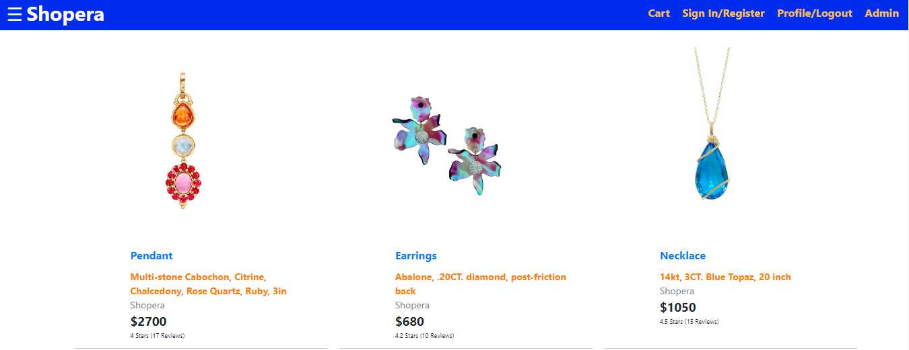
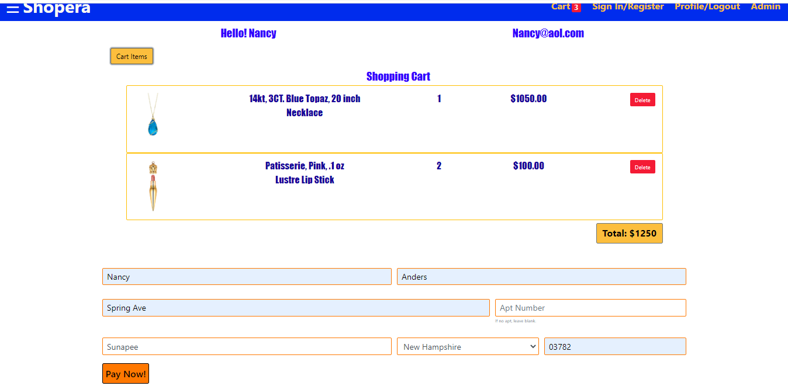
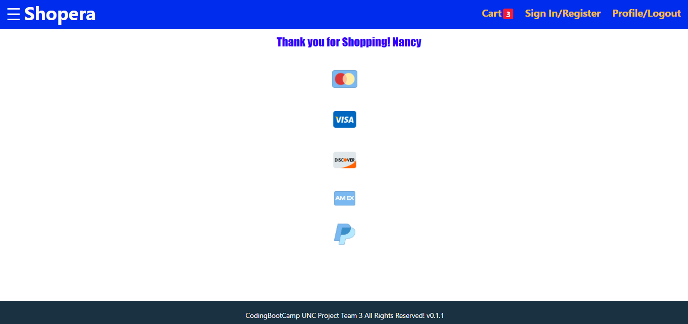
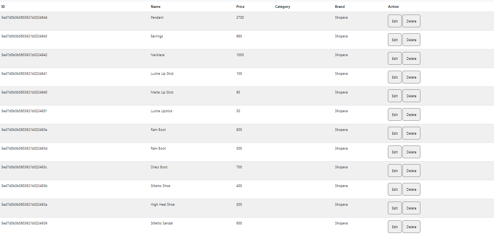

# Shopera

Shopera is a complete e-commerce site bootstrapped with the [Create React App](https://github.com/facebook/create-react-app). It is a versatile app that can be utilized by any client with an inventory to host.

 ## Table of Contents: 
  * Installation 
  * Usage 
  * License 
  * Contributing 
  * Questions 
  * Images 
   
   #### Installation: 

   npm install
   
   ### Technology: 
   * [React documentation](https://reactjs.org/).
   * [Create React App documentation](https://facebook.github.io/create-react-app/docs/getting-started)
   * [ReactDom](https://reactjs.org/docs/react-dom.html)
   * [React-router-dom](https://www.npmjs.com/package/react-router-dom)
   * [React-Redux](https://react-redux.js.org/)
   * [React-beautiful-dnd](https://www.npmjs.com/package/react-beautiful-dnd)
   * [Reactstrap](https://reactstrap.github.io/)
   * [MongoDB](https://www.mongodb.com/)
   * [Axios](https://www.npmjs.com/package/axios)
   * [Express](https://expressjs.com/)
   * [JS-Cookie](https://www.npmjs.com/package/js-cookie)
   * [Bootstrap](https://getbootstrap.com/)
   * [JWT Authentication](https://www.jsonwebtoken.io/)

   
   #### License: 

   ISC: 
   
   ### Contributions: 
   
   * [Shuyun Mu](https://github.com/mushuyun)
   * [Karna Cutolo](https://github.com/Karna1014)
   * [Jon Handy](https://github.com/jhandy4)
   
   

   ### Questions: 
   
   #### If you have any questions about this repo, please reach out: 

   * **Email: karna.cutolo@gmail.com**
   * **Email: rtpice.mu@gmail.com**
   * **Email: jhandy4@gmail.com**
     
   #### Images: 

   **Shopera Home Page**

   

   **Shopera Order Page**

   

   **Shopera Payment Page**

   

   **Shopera Profile Page**

   

   **Shopera Admin Page**

   

   **Shopera ProdUpdate Page**

   

